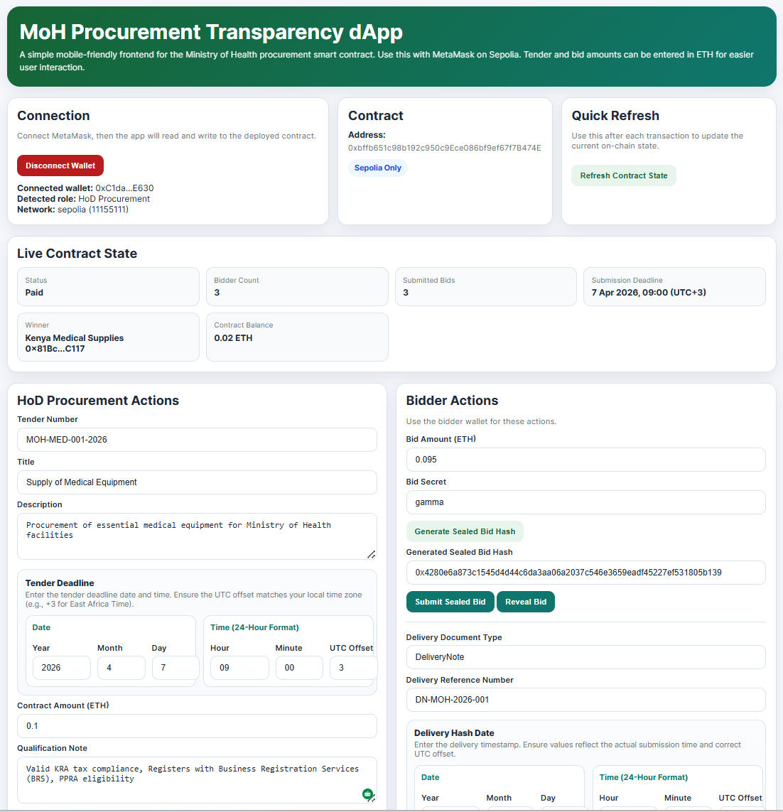
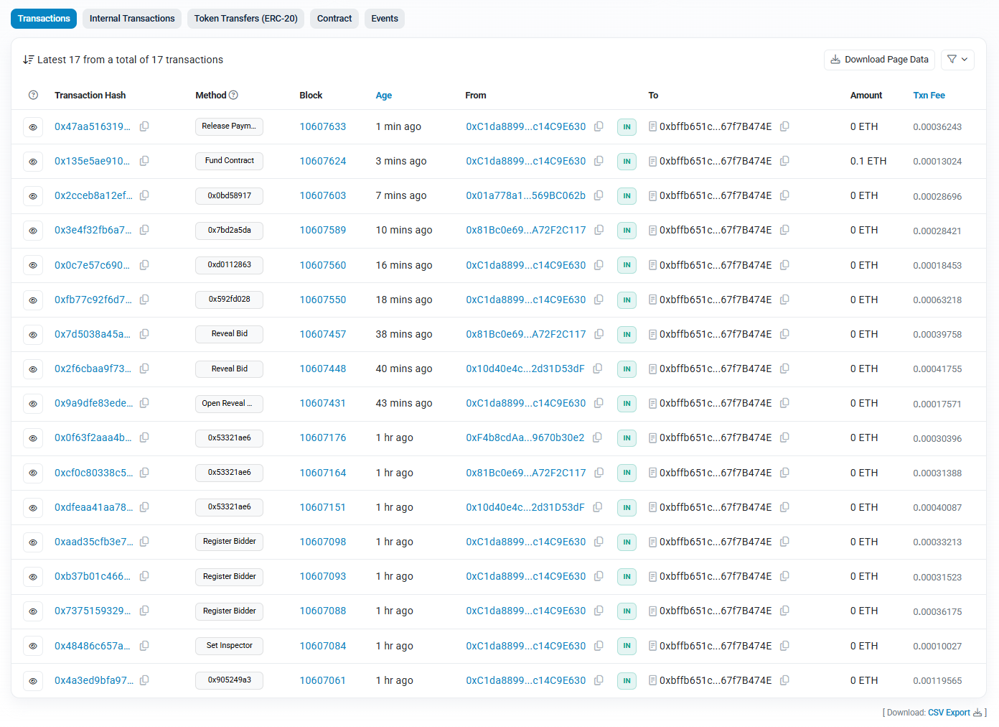

# MoH Procurement Transparency dApp

## 📌 Overview

This project implements a blockchain-based procurement transparency system for the Ministry of Health using Ethereum smart contracts and a web-based frontend.

It enhances transparency, auditability, and fairness in public procurement.

---

## ⚙️ Features

* Sealed bid submission (commit-reveal)
* Bidder registration and role-based access control
* Tender lifecycle management
* Delivery verification and inspection
* Conditional payment release
* Real-time contract state dashboard

---

## 🧠 Architecture

| Layer          | Technology                    |
| -------------- | ----------------------------- |
| Smart Contract | Solidity                      |
| Frontend       | HTML + JavaScript (Ethers.js) |
| Wallet         | MetaMask                      |
| Network        | Sepolia                       |

---

## 📸 Screenshots

### Disgramatic Representation of the System

### UI Overview

### Transactions

### Activity Log

---
## 🔗 Links

🧾 **Smart Contract Address (Sepolia Network)**
0xbffb651c98b192c950c9Ece086bf9ef67f7B474E

🧾 **Blockchain Explorer (Sepolia Etherscan)**
https://sepolia.etherscan.io/address/0xbffb651c98b192c950c9Ece086bf9ef67f7B474E

🎥 **Demo Video**
https://drive.google.com/file/d/1EB0JPFDUTQqUYlMu63gNiXIQ7-q5XRjG/view?usp=sharing

💻 **GitHub Repository (Full Project Codebase)**
https://github.com/Dorringtone/moh-procurement-dapp

🌐 **Frontend (dApp Interface)**
https://dorringtone.github.io/moh-procurement-dapp/

🖥️ **Frontend Source Code (Web dApp Interface)**
https://github.com/Dorringtone/moh-procurement-dapp/blob/main/index.html

📄 **Smart Contract Source Code**
https://github.com/Dorringtone/moh-procurement-dapp/blob/main/contracts/KenyaProcurementTransparency.sol

---

## 🚀 How to Use

1. Connect MetaMask (Sepolia)
2. Register bidders
3. Submit sealed bids
4. Open reveal phase
5. Reveal bids
6. Evaluate and award
7. Submit delivery
8. Inspect and release payment

---

## ⚠️ Notes

* Prototype for academic/demo use
* Not production audited

---

## 📄 License

EBU License
